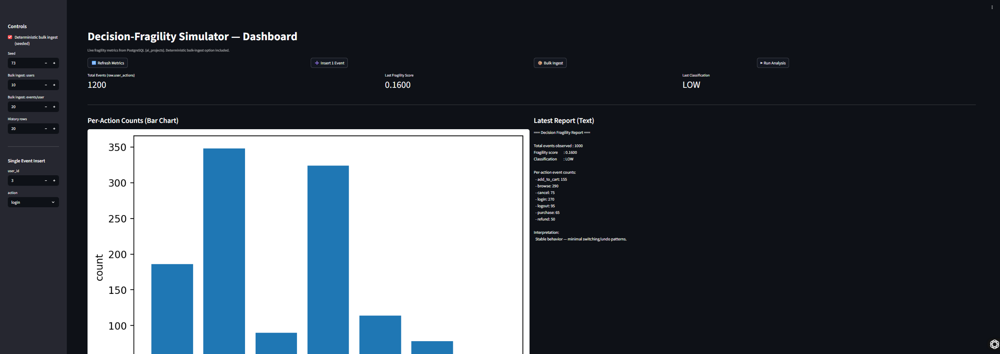

# 🧠 Decision-Fragility Simulator

<p align="center">

<!-- Deployment Status -->
<a href="https://app.fragility-sim.com">
  
</a>

<!-- License -->
<a href="https://github.com/Gemini-cr73/decision-fragility-simulator/blob/main/LICENSE">
  
</a>

<!-- Tech Stack -->


<!-- Version -->


<!-- Social Proof -->


</p>

> The Decision-Fragility Simulator is a full-stack cloud analytics app that models how user decision behavior becomes more or less stable over time. Built with Python, Streamlit, Docker, and PostgreSQL, and deployed on Azure with HTTPS-secured custom domain — this project demonstrates cloud deployment skills, behavioral analytics, and end-to-end DevOps execution.

**Live App:** https://app.fragility-sim.com  
**Status:** ✓ Online & Secure (HTTPS)  
**Tech Stack:** Python · Streamlit · PostgreSQL · Docker · Azure Container Apps

## 📸 App Demo

<p align="center">
  <b>Decision-Fragility Simulator — Live Dashboard</b><br>
  
</p>

**What’s Happening Here**
- Live ingestion from PostgreSQL
- Per-action behavior analysis
- Fragility score auto-classification (LOW / MEDIUM / HIGH)
- Secure Azure deployment with HTTPS 🔐

<p align="center">
  <b>Repository Structure & Cloud Deployment Setup</b><br>
  
</p>

**Why It Matters**
- Shows professional project organization 🗂️
- Highlights ability to deploy containerized apps in Azure 🚀
- Demonstrates full DevOps lifecycle experience ✔️

## 🧱 Architecture Overview

The Decision-Fragility Simulator is deployed as a fully containerized cloud analytics app:

- **User Browser** → **Cloudflare**  
  Provides DNS routing and HTTPS security for `app.fragility-sim.com`
- **Cloudflare** → **Azure Web App (Docker Container)**  
  Hosts the Streamlit user interface and fragility analytics engine
- **Azure Web App** ↔ **PostgreSQL Database**  
  Stores the `user_actions` dataset for machine-calculated fragility scores
- **Azure Web App** → **Azure Monitor / Logs**  
  Tracks performance and behavior analytics in production
- **Local Dev Machine** → **Docker Compose + VS Code**  
  Exact same container image used for Azure deployment → full DevOps reproducibility

## 📌 Overview

The **Decision-Fragility Simulator** models how user decision actions become more or less stable over time.  
It analyzes **behavior patterns** such as:

- Add to cart
- Browse product pages
- Login / logout
- Purchase vs cancel
- Refund requests

The simulator assigns a **Fragility Score**, indicating whether behavior is:

| Score Range | Classification | Meaning |
|------------|----------------|--------|
| < 0.20     | LOW            | Stable decision-making |
| 0.20–0.50  | MEDIUM         | Increasing volatility |
| > 0.50     | HIGH           | Fragile — constant changing of mind |

## 🎮 Key Features

✔ Real-time ingestion of synthetic user actions  
✔ PostgreSQL data persistence  
✔ Automated Fragility Score computation  
✔ Visual analytics: bar charts + behavior summaries  
✔ Ability to simulate thousands of user events  
✔ Secure HTTPS + custom domain deployment

## 🔥 Next Deliverables

Here’s what’s next — in order:

| Step | Task |
|------|------|
| 1️⃣ | You paste / commit this README.md into GitHub |
| 2️⃣ | I add an MIT LICENSE to your repo |
| 3️⃣ | Upload screenshots → `/docs/` folder |
| 4️⃣ | Publish GitHub Release v1.0.0 |
| 5️⃣ | Add GitHub badges (live status, deployment, tech stack) |

### ❓ Ready?

Reply:

> 👍 Add LICENSE + Screenshots + Badges next

or

> ✍️ Edit the README first (tell me what to change)

Would you like me to **auto-add your name + LinkedIn + GitHub badge** at the top too?

## 🛠️ System Architecture

```ascii
User → Streamlit UI → Fragility Analysis Service → Postgres DB → Dashboard


